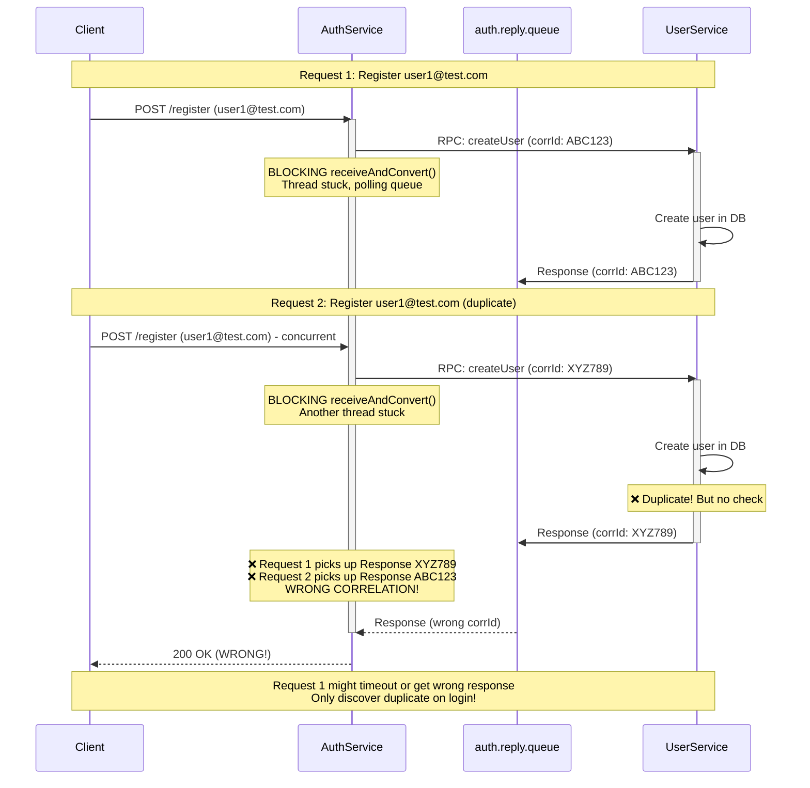
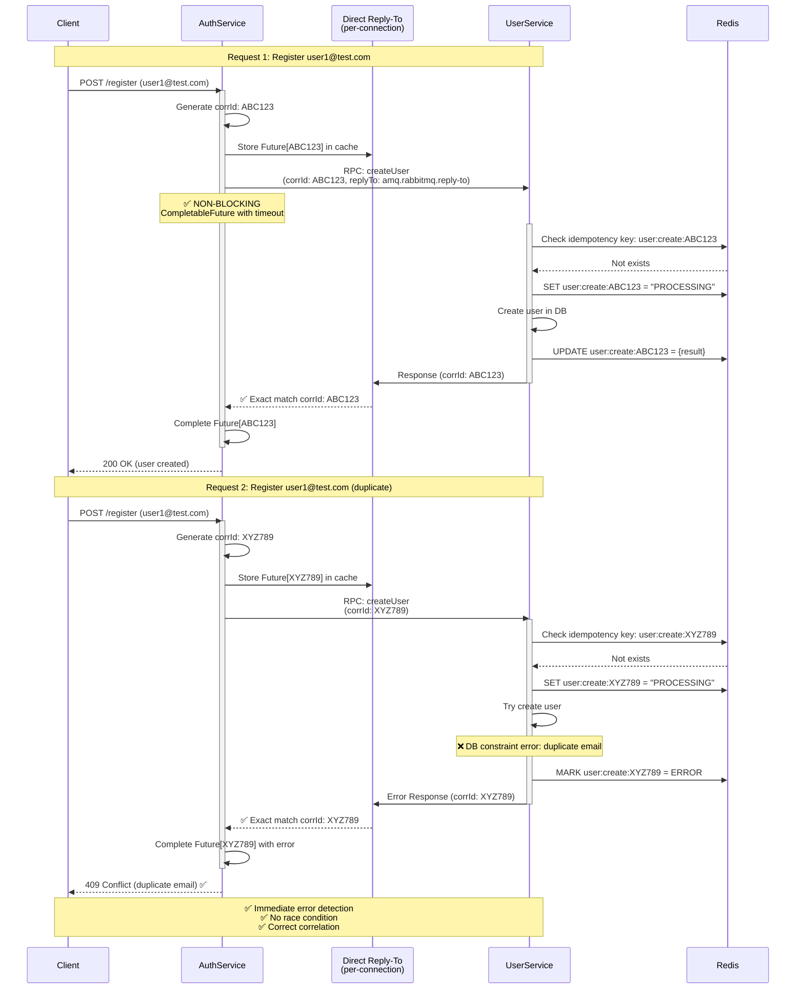
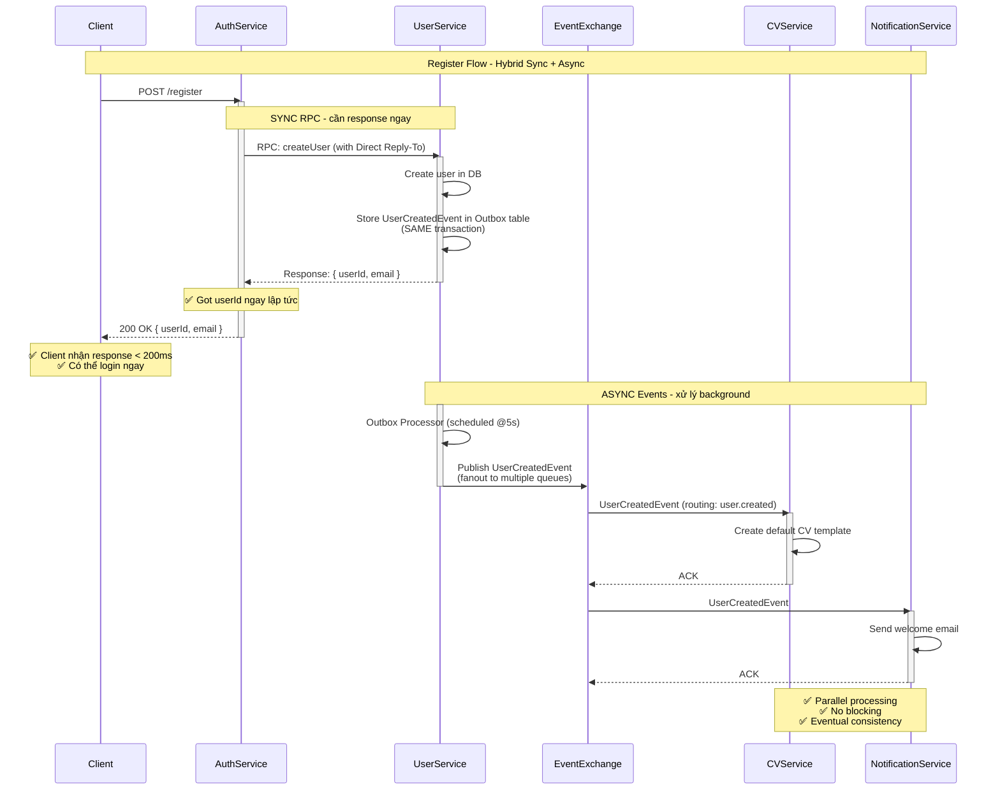
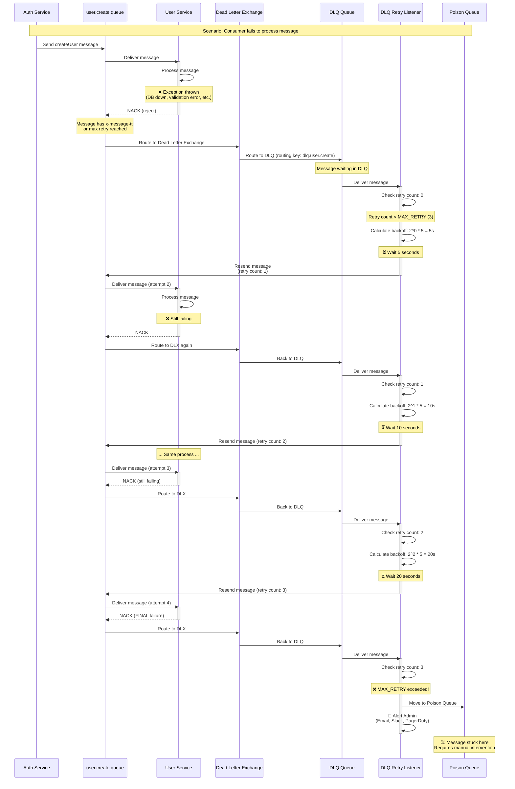
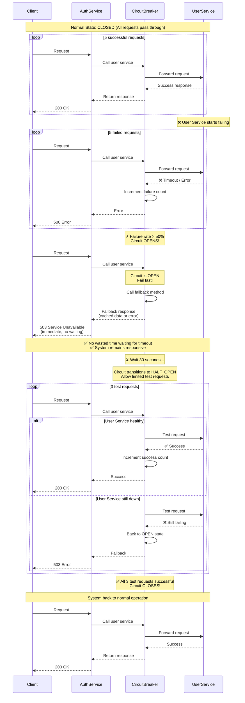
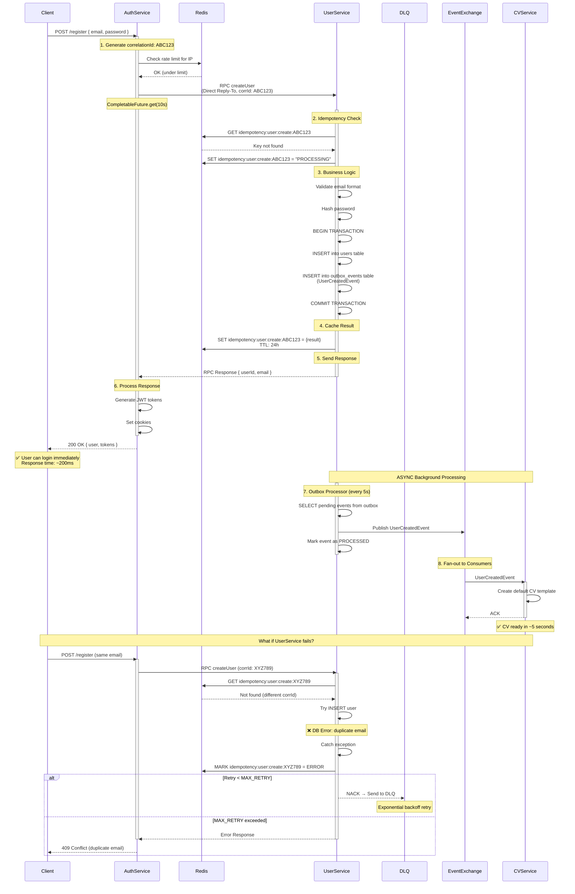

# 📊 Sequence Diagrams - RabbitMQ Architecture

## 1. Current Architecture (Problematic) - Register Flow

---

## 2. Improved Architecture - Register Flow

---

## 3. Hybrid Flow: Sync RPC + Async Events

---

## 4. Dead Letter Queue (DLQ) Flow

---

## 5. Circuit Breaker Flow

---

## 6. Full Register Flow với All Improvements

Tất cả các diagrams này minh họa:
- ✅ **Fixed race conditions** với Direct Reply-To
- ✅ **Idempotency** với Redis
- ✅ **Resilience** với DLQ và Circuit Breaker
- ✅ **Performance** với Async events
- ✅ **Reliability** với Outbox pattern
